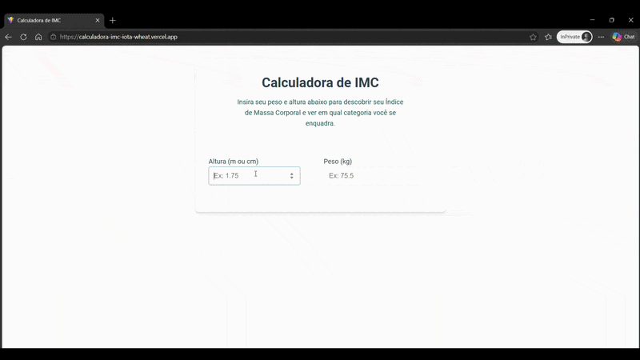

  

# ⚖️ Calculadora de IMC (React + Vite)

Uma aplicação web interativa desenvolvida em React para o cálculo do Índice de Massa Corporal (IMC). O projeto foi estruturado com foco no gerenciamento de estados dinâmicos, componentização eficiente e reatividade em tempo real, utilizando o ecossistema moderno do Vite.

> 🎓 **Projeto Acadêmico:** Desenvolvido como parte do programa de formação frontend da **EBAC (Escola Britânica de Artes Criativas e Tecnologia)**.

---

## 🚀 Tecnologias Utilizadas

* **React** – Biblioteca JavaScript baseada em componentes para construção da interface de usuário.
* **Vite** – Ferramenta de build ultra-rápida que substitui o Create React App, oferecendo Fast Refresh (HMR) quase instantâneo em desenvolvimento.
* **JavaScript (ES6+)** – Lógica matemática para o cálculo e filtragem de resultados.
* **CSS3 / CSS Modules** – Estilização e layout responsivo garantindo o isolamento de escopo dos estilos dos componentes.

---

## ✨ Funcionalidades e Diferenciais

* **Cálculo Baseado em Componentes:** Interface dividida de forma modular para facilitar a manutenção e escalabilidade do código.
* **Gerenciamento de Estado Dinâmico:** Uso de hooks do React para capturar as entradas do usuário (peso e altura) e renderizar os resultados imediatamente na tela.
* **Classificação de Saúde Automatizada:** Aplicação de regras condicionais para categorizar o resultado de acordo com as faixas oficiais de IMC (*Abaixo do peso, Peso normal, Sobrepeso, Obesidade*).
* **Feedback Visual Limpo:** Exibição do resultado de forma estilizada e de fácil leitura para o usuário.
* **Design Responsivo:** Adaptado para proporcionar uma excelente experiência de uso tanto em dispositivos móveis quanto em desktops.

---

🧠 Principais Aprendizados (EBAC)
Pensamento em Componentes: Divisão da interface em blocos menores e reutilizáveis, entendendo o fluxo de dados unidirecional do React.

Hooks (useState): Manipulação e persistência de estados locais dentro da aplicação para refletir mudanças na UI sem recarregar a página.

Otimização com Vite: Configuração e uso de um ecossistema moderno de build, compreendendo as vantagens de performance em relação a ferramentas tradicionais de empacotamento.
